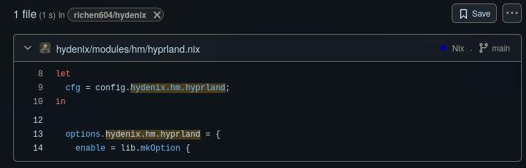

# Hydenix Options

- [Hydenix Options](#hydenix-options)
  - [Module Documentation](#module-documentation)
  - [Required Options](#required-options)
  - [Default Options](#default-options)

## Module Documentation

Going to let you in on a secret: The Nix options system *is* the documentation.

Let's walk through an example. Say you want to find info about `hydenix.hm.hyprland`.

The easiest way is to search the GitHub repo for the options:

[search for `hydenix.hm.hyprland`](https://github.com/richen604/hydenix/search?q=hydenix.hm.hyprland)

You'll see the options in the search results, something like this:



Click on the file to see the actual options definition, which looks something like this:

```nix
  options.hydenix.hm.hyprland = {
    enable = lib.mkOption {
      type = lib.types.bool;
      default = config.hydenix.hm.enable;
      description = "Enable hyprland module";
    };

    extraConfig = lib.mkOption {
      type = lib.types.lines;
      default = "";
      description = "Extra config for hyprland";
    };
  };
```

Notice that `extraConfig` has type `lines`, which means it accepts multiline strings.
So you'd configure it like this:

```nix
hydenix.hm.hyprland.extraConfig = ''
  # hyprland.conf
  windowrule = float, ^(.*)
''
```

You can find the full list of option types in the [NixOS manual](https://nlewo.github.io/nixos-manual-sphinx/development/option-types.xml.html).

## Required Options

These are the required options for hydenix.
You *must* set these options or else hydenix will not load.

```nix
{
  hydenix = {
    enable = true; # enable hydenix - required, default false
    hostname = "hydenix"; # hostname
    timezone = "America/Vancouver"; # timezone
    locale = "en_CA.UTF-8"; # locale
    hm.enable = true;
  };
}
```

## Default Options

Below will be the default options for hydenix.

```nix
{
  hydenix = {

    #! Important options
    enable = true; # enable hydenix - required, default false
    hostname = "hydenix"; # hostname
    timezone = "America/Vancouver"; # timezone
    locale = "en_CA.UTF-8"; # locale

    #! NixOS hydenix options
    audio.enable = true; # enable audio module
    boot = {
      enable = true; # enable boot module
      useSystemdBoot = true; # disable for GRUB
      grubTheme = "Retroboot"; # or "Pochita"
      grubExtraConfig = ""; # additional GRUB configuration
      kernelPackages = pkgs.linuxPackages_zen; # default zen kernel
    };
    gaming.enable = true; # enable gaming module
    hardware.enable = true; # enable hardware module
    network.enable = true; # enable network module
    nix.enable = true; # enable nix module
    sddm = {
      enable = true; # enable sddm module
      theme = "Candy" # or "Corners"
    };
    system.enable = true; # enable system module

    #! Home Manager hydenix options
    hm = {
      enable = true; # enable home-manager module
       #! Below are defaults
    comma.enable = true; # useful nix tool to run software without installing it first
    dolphin.enable = true; # file manager
    editors = {
      enable = true; # enable editors module
      neovim.enable = true; # enable neovim module
      vscode = {
        enable = true; # enable vscode module
        wallbash = true; # enable wallbash extension for vscode
      };
      vim.enable = true; # enable vim module
      default = "code"; # default text editor
    };
    fastfetch.enable = true; # fastfetch configuration
    firefox.enable = true; # enable firefox module
    gaming.enable = true; # enable gaming module
    git = {
      enable = true; # enable git module
      name = null; # git user name eg "John Doe"
      email = null; # git user email eg "john.doe@example.com"
    };
    hyde.enable = true; # enable hyde module
    hyprland = {
      enable = true; # enable hyprland module
      extraConfig = ""; # extra config appended to userprefs.conf
      overrideMain = null; # complete override of hyprland.conf
      suppressWarnings = false; # suppress warnings
      # Animation configurations
      animations = {
        enable = true; # enable animation configurations
        preset = "standard"; # animation preset: "classic", "diablo-1", "diablo-2", "dynamic", "disable", "eevee-1", "eevee-2", "high", "low-1", "low-2", "minimal-1", "minimal-2", "moving", "optimized", "standard", "vertical", "LimeFrenzy"
        extraConfig = ""; # additional animation configuration
        overrides = { }; # override specific animation files by name
      };
      # Shader configurations
      shaders = {
        enable = true; # enable shader configurations
        overrides = { }; # override or add custom shaders
      };
      # Workflow configurations
      workflows = {
        enable = true; # enable workflow configurations
        active = "default"; # active workflow preset: "default", "editing", "gaming", "powersaver", "snappy"
        overrides = { }; # override or add custom workflows
      };
      # Hypridle configurations
      hypridle = {
        enable = true; # enable hypridle configurations
        extraConfig = ""; # additional hypridle configuration
        overrideConfig = null; # complete hypridle configuration override (null or lib.types.lines)
      };
      # Keybindings configurations
      keybindings = {
        enable = true; # enable keybindings configurations
        extraConfig = ""; # additional keybindings configuration
        overrideConfig = null; # complete keybindings configuration override (null or lib.types.lines)
      };
      # Window rules configurations
      windowrules = {
        enable = true; # enable window rules configurations
        extraConfig = ""; # additional window rules configuration
        overrideConfig = null; # complete window rules configuration override (null or lib.types.lines)
      };
      # NVIDIA configurations
      nvidia = {
        enable = false; # enable NVIDIA configurations (defaults to config.hardware.nvidia.enabled)
        extraConfig = ""; # additional NVIDIA configuration
        overrideConfig = null; # complete NVIDIA configuration override (null or lib.types.lines)
      };
      # Monitor configurations
      monitors = {
        enable = true; # enable monitor configurations
        overrideConfig = null; # complete monitor configuration override (null or lib.types.lines)
      };
    };
    lockscreen = {
      enable = true; # enable lockscreen module
      hyprlock = true; # enable hyprlock lockscreen
      swaylock = false; # enable swaylock lockscreen
    };
    notifications.enable = true; # enable notifications module
    qt.enable = true; # enable qt module
    rofi.enable = true; # enable rofi module
    screenshots = {
      enable = true; # enable screenshots module
      grim.enable = true; # enable grim screenshot tool
      slurp.enable = true; # enable slurp region selection tool
      satty.enable = false; # enable satty screenshot annotation tool
      swappy.enable = true; # enable swappy screenshot editor
    };
    wallpapers.enable = true; # enable wallpapers module
    shell = {
      enable = true; # enable shell module
      zsh = {
        enable = true; # enable zsh shell
        plugins = [ "sudo" ]; # zsh plugins
        configText = ""; # zsh config text
      };
      bash.enable = false; # enable bash shell
      fish.enable = false; # enable fish shell
      pokego.enable = false; # enable Pokemon ASCII art scripts
      p10k.enable = false; # enable p10k prompt
      starship.enable = true; # enable starship prompt
    };
    social = {
      enable = true; # enable social module
      discord.enable = true; # enable discord module
      webcord.enable = true; # enable webcord module
      vesktop.enable = true; # enable vesktop module
    };
    spotify.enable = true; # enable spotify module
    swww.enable = true; # enable swww wallpaper daemon
    terminals = {
      enable = true; # enable terminals module
      kitty = {
        enable = true; # enable kitty terminal
        configText = ""; # kitty config text
      };
    };
    theme = {
      enable = true; # enable theme module
      active = "Catppuccin Mocha"; # active theme name
      themes = [ "Catppuccin Mocha" "Catppuccin Latte" ]; # default enabled themes, full list in https://github.com/richen604/hydenix/tree/main/hydenix/sources/themes
    };
    waybar = {
      enable = true; # enable waybar module
      userStyle = ""; # custom waybar user-style.css
    };
    wlogout.enable = true; # enable wlogout module
    xdg.enable = true; # enable xdg module
    };
  };
}
